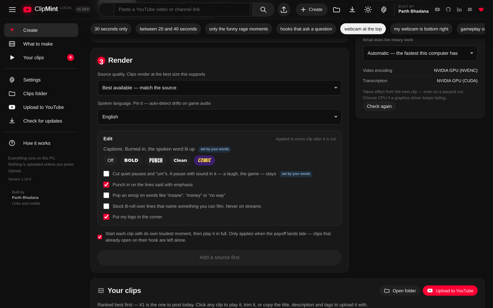
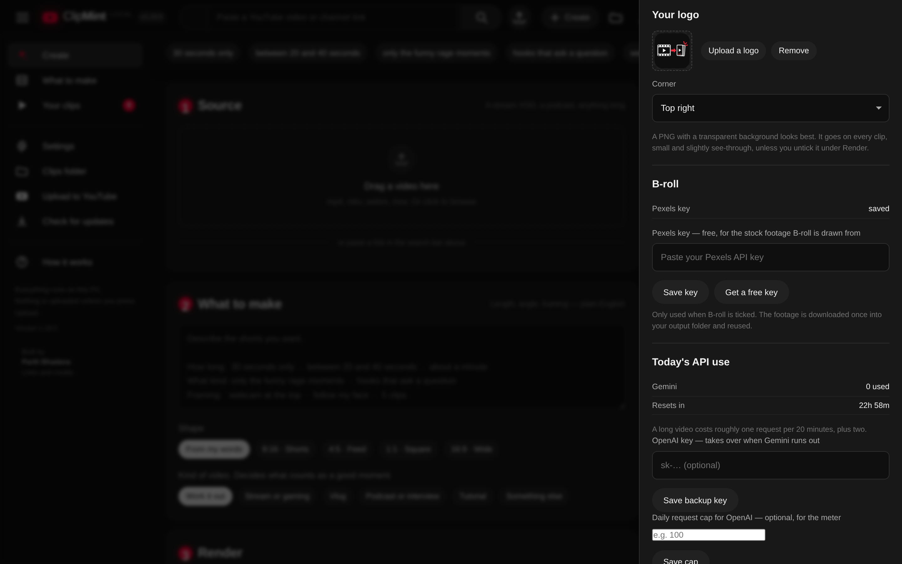
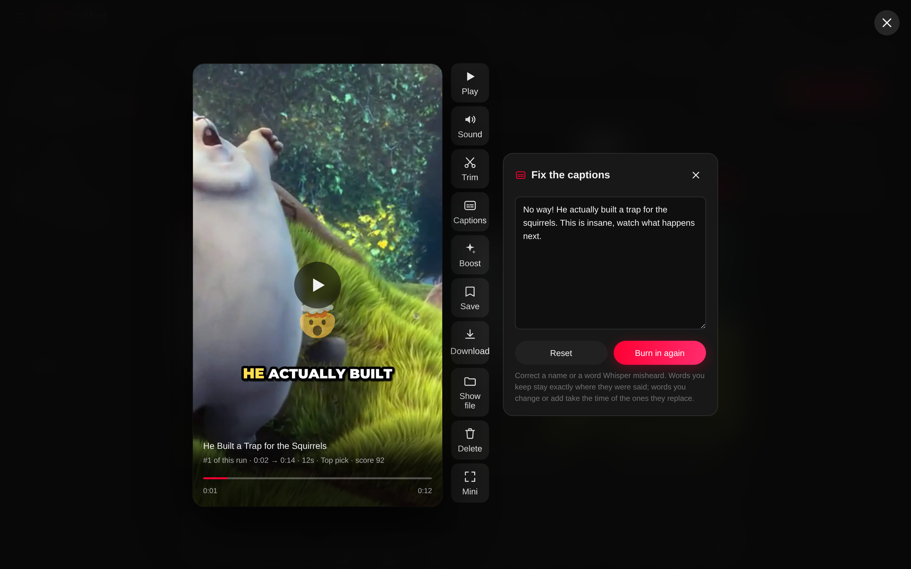
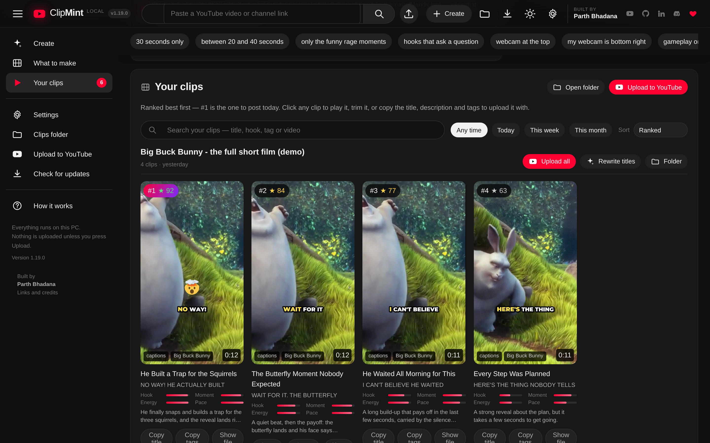
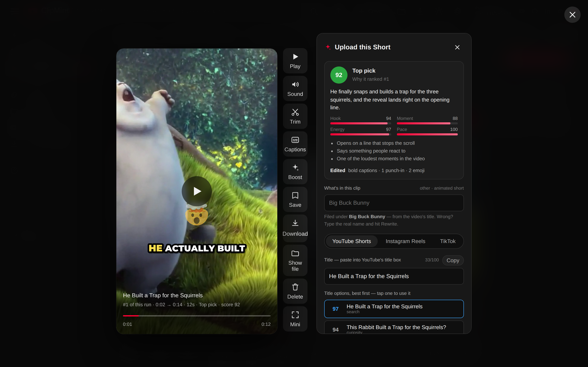

# Captions, the edit, and why a clip ranked

Since v1.19.0, every clip ClipMint makes comes back edited: captions burned
in, dead air cut, a zoom on the line that matters. Each clip also tells you why
it ranked where it did. This guide covers what each of those does, how to
change it, and what to do when it gets something wrong.

1. [Captions](#1-captions)
2. [Pause cuts and punch-ins](#2-pause-cuts-and-punch-ins)
3. [Emoji, B-roll and your logo](#3-emoji-b-roll-and-your-logo)
4. [Setting it all in words](#4-setting-it-all-in-words)
5. [Fixing a misheard word](#5-fixing-a-misheard-word)
6. [Why a clip ranked where it did](#6-why-a-clip-ranked-where-it-did)
7. [What it costs, and when it doesn't run](#7-what-it-costs-and-when-it-doesnt-run)

For how the code does all this, see
[HOW_IT_WORKS.md §7.7 and §7.8](../HOW_IT_WORKS.md#77-the-edit--autoeditpy-captionspy-wordspy-brollpy).

---

## 1. Captions

Most Shorts are watched with the sound off, so the captions go on the video
itself: a few words at a time, big, with the word being said lit up as it is
said.

Pick a style under **Render → Edit → Captions**:

| Style | Looks like | Words at a time |
|---|---|---|
| **Bold** (default) | Heavy white capitals, the spoken word in yellow and a little larger | 3 |
| **Punch** | Tall condensed capitals, the spoken word in green | 2 |
| **Clean** | Sentence case on a dark box, the spoken word in gold, no bounce | 5 |
| **Comic** | Comic-book capitals with a purple outline, the spoken word in gold | 3 |
| **Off** | No captions | — |

The live preview shows the style you picked, in the real typeface, where it
will sit on the clip:

- **Webcam-over-gameplay:** on the seam between the two panels, covering
  neither your face nor the game.
- **Face-following or gameplay-only, 9:16:** at about 70% of the height,
  above the band where TikTok, Reels and Shorts draw their own buttons.
- **Square, 4:5 and 16:9:** a little lower.

Lines break where you pause or finish a clause, not only at the word limit.
Japanese, Chinese and Thai are joined without spaces. The fonts ship with the
app, so captions look the same on every PC.

---

## 2. Pause cuts and punch-ins

**Cut quiet pauses and "um"s** (on by default). A gap between words is cut down
to a short breath only if it is actually quiet: nothing louder than about a
third of your speaking level all the way through. So these are kept:

- a pause with **sound in it**: a laugh, the game going off, music;
- the **quiet beat just before the clip's loudest moment**, because that
  build-up is part of why the clip was picked;
- anything on a **stream** shorter than about a second, because a streamer's
  silence is usually the streamer watching the game.

"Um", "uh", "erm" and "hmm" are cut. "Like" and "you know" aren't: they're
filler half the time and meaning the other half.

The cold open, where the clip opens on its loudest moment, follows the cuts,
so it still opens on the right second.

**Punch in on emphasis** (on by default). The frame zooms in a little (1.14×)
on lines said with emphasis: a reaction phrase like "no way", a line with an
exclamation mark, or one of the loudest words in the clip. That happens at most
once every eight seconds or so. On the webcam layout the zoom aims at your
face. On a face-following clip, jump cuts also alternate between two framings,
so a cut reads as a new angle rather than a stumble.

---

## 3. Emoji, B-roll and your logo

**Emoji** (off by default) pop over words like *insane*, *money*, *no way*,
*funny* or *scary*: a few per clip, never the same one twice. The word list is
English only.

**B-roll** (off by default) lays two or three seconds of stock footage over
lines that name something you can film, like *"I moved to Tokyo"* or *"I bought
a new car"*. It needs:

- a **free Pexels key**: *Settings → B-roll → Get a free key*, then paste it and
  **Save key**;
- your AI provider, which reads each clip's lines and picks at most two
  moments, never in the first three seconds or the last two.

It is never used on a stream, where the gameplay is the picture. Most
talking-head clips name nothing concrete enough, and those get no B-roll,
which is the right answer. Footage is downloaded once into `output/b-roll/`
and reused; **Clear space** in Settings deletes it.

**Your logo** goes in the corner of every clip once you upload one: *Settings →
Your logo → Upload a logo*. A PNG with a transparent background looks best. Pick
the corner there. The bottom corners sit above the apps' own buttons, not in
the very corner. It is small (16% of the frame's shorter side) and slightly
see-through. Untick **Put my logo in the corner** under Render to leave it off
a run.

---

## 4. Setting it all in words

Everything above can be said in the prompt, and **the words win** over the
switches. The switch the words decided shows a *set by your words* tag; to
change it, change the words.

| Say | Does |
|---|---|
| `comic captions`, `captions in punch` | that caption style |
| `no captions`, `subtitles off` | no captions |
| `keep the pauses`, `no jump cuts` | no pause cuts |
| `cut the pauses`, `remove the dead air` | pause cuts on |
| `no zooms`, `no punch-ins` | no punch-ins |
| `add emoji` / `no emoji` | emoji on or off |
| `add b-roll` / `no b-roll` | B-roll on or off |
| `add my logo` / `no logo` | your logo on or off |

These combine with everything else the prompt understands: *"30 second clips,
follow my face, comic captions, keep the pauses"*.

The switches under Render are remembered on this PC, so your usual caption
style is already picked next time.

---

## 5. Fixing a misheard word

Whisper gets names wrong. Open the clip, press **Captions** in the player's
rail (or **C**), and the box holds the captions as one line of text. Type it as
it should read and press **Burn in again**.

- Words you **keep** stay exactly where they were said.
- Words you **change or add** take the time of the words they replace.
- The **cuts don't change**: they follow what was actually said, so deleting
  an "um" from the text doesn't bring back a pause.
- **Reset** puts back what Whisper heard.

The clip is rendered again from the downloaded video, on the same span with
the same edit, so the video it came from has to still be on this PC. Trimming a
clip gives it a new span and new words, so a trim drops any fixes; fix the
captions after the trim, not before.

The Captions button only appears on clips made with captions on, in v1.19.0 or
later.

---

## 6. Why a clip ranked where it did

Every clip card shows four bars under its title, and the model's own sentence
on why the moment works:

| Bar | Measures | From |
|---|---|---|
| **Hook** | How hard the first line stops a scroll | the model |
| **Moment** | How strong the moment is as a whole | the model |
| **Energy** | How loud its peak is against the rest of the video | the audio |
| **Pace** | How quickly the talking starts | the words |

A bar is only drawn when it was actually measured. A video with no usable
audio has no Energy bar rather than an empty one.

Open **Boost** on a clip for the numbers, a grade, a few plain notes (*"A quiet
beat before the payoff"*, *"Slow first seconds cost it points"*), and a line
saying what the edit did to it:

| Grade | Score |
|---|---|
| Top pick | 85 and up |
| Strong | 70–84 |
| Worth a look | 55–69 |
| Long shot | under 55 |

Read the bars together. **Strong moment, weak hook** means the clip is good but
opens flat: post it with a strong cover line, or trim the start. **Strong hook,
weak moment** opens well and may not hold people to the end.

**Sort** above the grid reorders each run: *Ranked*, *Strongest hook*, *Most
energy* or *Shortest first*.

Clips from exact spans you typed (`cut 14:45 to 15:30`) were never ranked, so
they have no score and no bars. Clips from older runs get their scorecard the
next time the library loads, from the numbers they already carried.

---

## 7. What it costs, and when it doesn't run

Each clip is listened to again, for seconds rather than hours, and encoded
once more. On a CPU that adds roughly the render time again; on an NVIDIA GPU,
very little. Switch captions off and untick the edit under Render and a run
takes exactly as long as it did before v1.19.0. The progress bar shows it as
its own stage, **Captions**.

It is skipped, and the clip keeps its plain render, when:

- the clip has **no speech**: nothing to caption, no pauses to find;
- **faster-whisper isn't installed**, when running from source with only
  `requirements.txt`;
- the **ffmpeg** in use was built without **libass**, the library that draws
  the captions. Every published build is checked for this before release;
  from source, `ffmpeg -filters | grep subtitles` tells you.

Every clip made **before v1.19.0** keeps its original look, even when trimmed.
Only new runs are edited.
